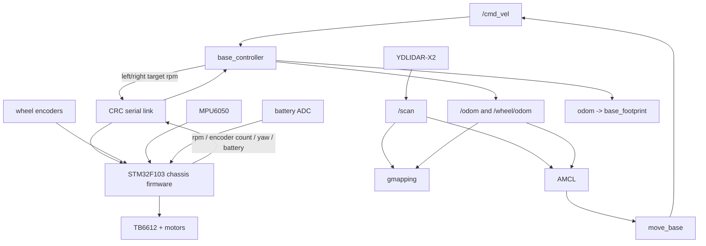

# ROS_DIFF v2 Software Architecture

本文概述 v2 的 ROS 上位机、STM32 下位机、串口协议、里程计和导航数据流。

v2 使用 Boost.Asio 承载自定义二进制协议。STM32 负责电机闭环、编码器采样和安全超时，树莓派负责 ROS 接口、里程计、建图和导航。

## System Overview



## Odometry Data Flow

1. STM32 的 100 Hz 任务读取左右编码器增量并累计为 int32 计数。
2. STM32 以 50 Hz 上报累计计数、滤波 rpm、MPU6050 yaw 和状态位。
3. ROS 使用累计计数差计算左右轮实际路程，不积分滤波 rpm。
4. `/wheel/odom` 只使用双轮差速模型，适合检查轮径、轮距和方向。
5. 默认 `/odom` 使用轮速角增量与 IMU yaw 增量互补融合。
6. `use_ekf:=true` 时，由 `robot_localization` 融合 `/wheel/odom` 和
   `/imu/data` 并发布 `/odom` 与 `odom -> base_footprint`。

前万向轮是被动支撑，不进入理想差速运动学公式。它造成的偏差主要表现为
地面打滑、载荷不均、转向阻力和“有效轮距”变化，应通过实际底盘标定与协方差
表达，而不是给里程计增加第三个主动轮约束。

## Coordinate And Geometry Model

坐标原点的 X/Y 位于驱动轮轴线中点，`base_footprint` 的 Z 位于地面；
`base_link` 位于轴心高度 24 mm。

| 项目 | 数值 |
| --- | --- |
| 整车外宽（含轮） | 148 mm |
| 轮宽 | 19 mm |
| 驱动轮中心距初值 | 129 mm |
| 整车长度 | 146 mm |
| 轴线到车尾 | 24 mm |
| 轴线到车头 | 122 mm |
| 驱动轮直径 | 48 mm |
| 理论轮周长 | 150.796 mm |
| 有效轮周长 | 144.765 mm |
| 万向轮接地点 | `x=+98 mm` |
| 雷达旋转中心 | `x=+80 mm, y=0, z=轴线上方130 mm` |
| 雷达朝向 | yaw=`pi`，扫描 0 度指向车尾 |
| MPU6050 安装 | 元件面朝下，默认反转 yaw 符号 |

导航 footprint 使用 `x=[-0.024, +0.122]`、
`y=[-0.074, +0.074]`，另加 10 mm 安全 padding。实际底盘更换后应重新测量轮距、轮径、雷达位姿和 footprint。

## Serial Protocol

STM32 v2 使用 `0x55 0xaa` 帧头。下行命令固定 11 字节，上行反馈固定
25 字节，两者均使用 CRC-8/MAXIM。命令与反馈轮速都是输出轴
`rpm * 100`；反馈还包含左右累计编码器计数、yaw、模式状态、电池 mV、
估算百分比和电池状态。完整字节布局以
[serial_protocol_v2.md](serial_protocol_v2.md) 为准。

## ROS Package Architecture

- `base_controller`：底盘串口、速度命令、里程计、TF、IMU 和电池状态。
- `robot_state_publisher`：发布 URDF 中的静态机器人结构。
- `ydlidar_ros_driver`：发布 YDLIDAR-X2 `/scan`。
- `slam_gmapping`：基于 `/scan` 和里程计构建 2D 地图。
- `map_server` + `amcl` + `move_base`：加载地图、定位并输出 `/cmd_vel`。
- `robot_localization`：可选 EKF 状态估计。

## Launch Entry Points

```bash
cd ~/ROS_DIFF/ros_diff_v2/catkin_ws
catkin_make
source devel/setup.bash
roslaunch myrobot bringup.launch enable_lidar:=true use_imu_yaw:=false
```

建图：

```bash
roslaunch myrobot mapping_v2.launch use_imu_yaw:=false use_ekf:=false rviz:=false
```

导航：

```bash
roslaunch myrobot navigation_v2.launch map_file:=/path/to/map.yaml use_imu_yaw:=false use_ekf:=false rviz:=false
```

远程电脑看 RViz：

```bash
export ROS_MASTER_URI=http://<raspberry_pi_ip>:11311
export ROS_IP=<pc_ip>
roslaunch myrobot remote_rviz.launch
```
